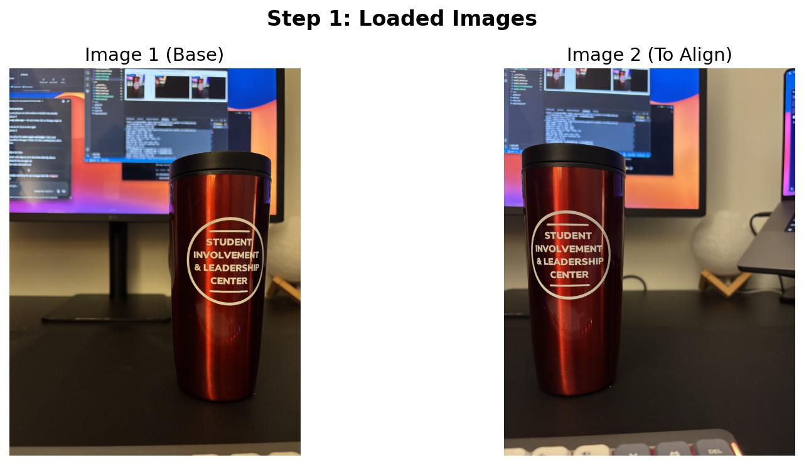
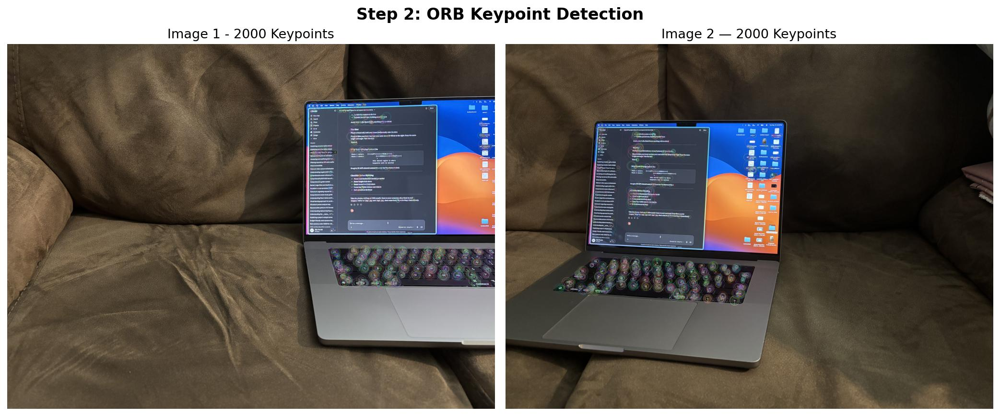
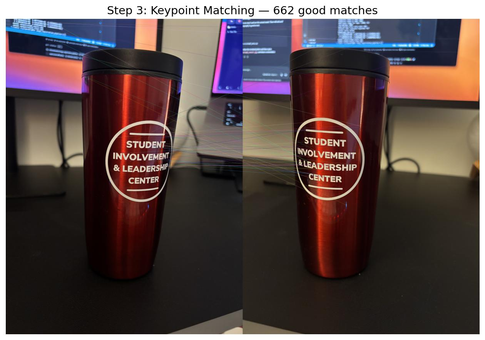
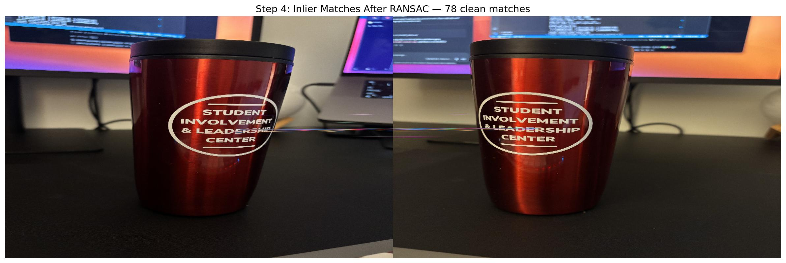
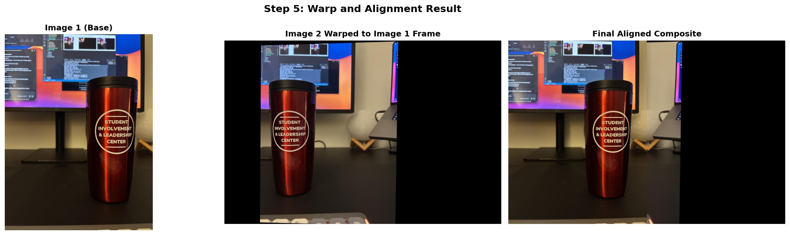

# image registration pipeline

a computer vision project that takes two overlapping photos and aligns them into one using feature matching. built this to learn opencv and understand image registration, which is one of the core techniques used in UAS-based fire perimeter mapping research.

---

## what does it actually do

takes two photos of the same scene shot from slightly different positions, finds matching points between them, computes a transformation matrix (homography), and warps one image into the other's coordinate frame. the output is a single aligned composite image.

the full pipeline looks like this:

```
load images → detect keypoints (ORB) → match keypoints (BFMatcher) → filter bad matches (RANSAC) → compute homography → warp + align
```

---

## why i built this

i read the 2026 IEEE JSTARS paper by Prof. Haiyang Chao's lab at KU on mapping wildfire perimeters using UAS thermal imagery. their pipeline registers orthomaps to a base map using feature matching, the exact same technique this project implements. wanted to understand it hands-on before anything else.

---

## outputs

**step 1 — loaded images:**



**step 2 — ORB keypoint detection:**



**step 3 — keypoint matching:**



**step 4 — inlier matches after RANSAC:**



**step 5 — final aligned composite:**



---

## how to run it

**1. clone the repo**

```bash
git clone https://github.com/[your-username]/image-registration
cd image-registration
```

**2. set up virtual environment**

```bash
python3 -m venv venv
source venv/bin/activate  # on mac/linux
# venv\Scripts\activate   # on windows
```

**3. install dependencies**

```bash
pip install -r requirements.txt
```

**4. add your images**

drop two overlapping photos into the `images/` folder and name them `img1.jpg` and `img2.jpg`. they should have about 50-70% overlap between them.

**5. run the full pipeline**

```bash
python main.py
```

all outputs save automatically to the `output/` folder.

---

## project structure

```
image-registration/
├── images/
│   ├── img1.jpg
│   └── img2.jpg
├── output/              <- all visualizations save here
├── src/
│   ├── step1_load.py    <- loads and resizes images
│   ├── step2_detect.py  <- ORB keypoint detection
│   ├── step3_match.py   <- BFMatcher + Lowe's ratio test
│   ├── step4_homography.py  <- RANSAC homography
│   └── step5_warp.py    <- perspective warp + composite
├── main.py              <- runs the full pipeline
└── requirements.txt
```

---

## what i learned

- how images are represented as numpy arrays and why opencv uses BGR not RGB
- what keypoints and descriptors actually are and why ORB is fast and patent-free
- how brute force matching works and why Lowe's ratio test filters ambiguous matches
- what a homography matrix is and how RANSAC makes it robust to wrong matches
- how perspective warping transforms every pixel using the H matrix

---

## tech stack

- python 3.x
- opencv (cv2)
- numpy
- matplotlib
